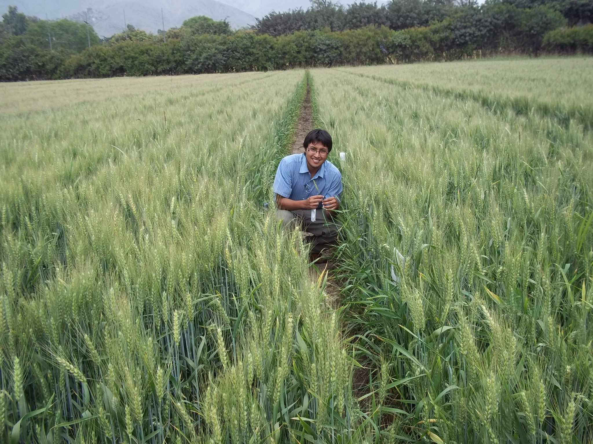

Flavio is a professional of agricultural sciences, specializing in research and data management with knowledge in the areas of physiology and plant breeding using conventional and biotechnological tools with computing  and programming skills to learn and use multiple applications to perform tasks optimally and efficiently. Leadership experience in management and coordination activities with persons of different hierarchical level.

```{r, echo=FALSE}

```

