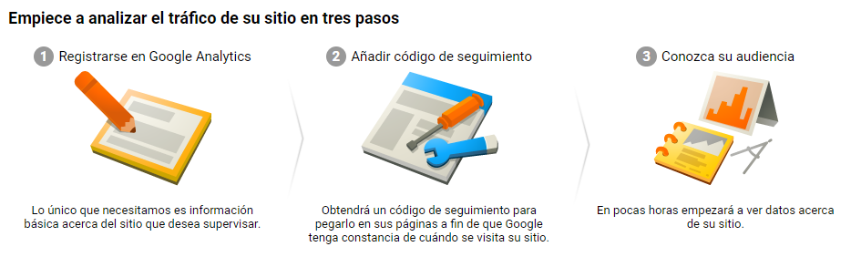
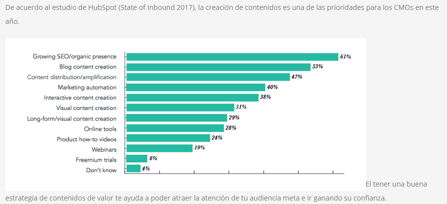

___
#User Acquisition Strategy / Estrategia de Adquisición de un Usuario.

La estrategia basada en INBOUND MARKETING, sostiene que el usuario ha cambiado, ello debido a los avances tecnológicos. Ahora el usuario tiene pleno control sobre su educación y mayor conciencia sobre lo que adquiere, y sobre todo  cuando se trata de tecnología, el consumidor se vuelve más juicioso. 

Por ello el INBOUND marketing busca desplegar una red de conduzta a la entrega de valor, una red que ayude al consumir encontrar su compañía. Incluso antes que el consumidor piense en comprarle. Y convertir ese awareness (conciencia) inicial en preferencia por su marca y últimas, en leads y negocios.

**En resúmen busca generar tráfico a su sitio web, conversiones e ingresos.** La web será el centro de operaciones de la empresa.

##Las 4 Etapas del comprador.

**Descubrimiento (awareness):** 

>Es el punto en el que el comprador busca contenido que le ayude resolver problemas generales y obtener respuestas sobre temas concretos.
>Por eso, todo lo que se publique en esta fase debe caracterizarse por ser totalmente educativo, no hablar de soluciones específicas y, mucho menos, mencionar tu producto o servicio. Se trata de que te consolides como una fuente de autoridad y fiable en el sector.

**Consideración:** 

>Es la fase donde la gente investiga sobre las diferentes soluciones que existen para resolver un problema o satisfacer una necesidad. Por lo tanto, el contenido debe centrarse en ello.

**Decisión:**

>Es el escenario donde los prospectos están dispuestos a escuchar sobre productos y servicios concretos, donde buscan contenidos y recursos que les ayuden a elegir entre una oferta y otra.

**Valoración del producto o servicio adquirido:**

>Se trata de la opinión de los clientes con respecto a todo el proceso anterior y a su experiencia como usuarios.

Pasos a Seguir.

##ESTRATEGIA BASADO EN CONTENIDO.

definir si desea: **ENSEÑAR** ó **INFORMAR**.

###A. Crear un blog. 

1. usa wordPress, tienen 27 000 plugin y 2 000 temas.
2. Usa un nombre de dominio sin residuos, único e irrepetible.
3. Protégete contra el spam y el malware. usa: All in One WP Security & Firewall.
4. Personaliza tu diseño. Adicional a la plantilla ponle tu marca.
5. Hazlo responsive.
6. Pon tu contacto.
7. Monitoriza todas las visitas. Usa el google Analytic, de donde viene tus lectores.
8. Crea menús estáticos.
9. Administra bien los usuarios, se prefesional con el trato a tus usuarios.
10. No dejes pasar mucho tiempo sin publicar contenido nuevo, mientra más contenido, mayor posicionamiento en google. (mínimo 1 cada semana).
11. Coloca términos clave en todos tus artículos.
12. Para los títulos, utiliza listas, “cómos” y preguntas directas. "Cómo puedo hacer mi tesis", ¿Cuanto cuesta hacer los analisis estadísticos?
13. Escribe para todos los públicos.
14. Escucha todos los comentarios.
15. Maximiza la difusión.

**Genera confianza y genera trafico a tu web.** Las publicaciones constantes general más tráfico. Y mayor porcentaje de _leads_

B. Haz contenido multimedia.

El objetivo es lograr la viralidad, que no es otro cosa aquello que el usuario decide por voluntad propia compartir.

1.- **Video presentación.** Graba presentando al equipo, refleja el problema y como lo piensas solucionar, envialo a tus posible clientes, es mucho mejor y menos invasivo que las llamadas. Luego llama a la acción.

2.- Videotutoriales:, genera valor sobre lso problemas del usuario y compartelos con el fin de lograr Leads.

3.- **Fotografías animadas.** Canalizar la infografia decuerdo a la red social, puesto que son públicos diferentes. Es importante llevar indicadores para encontrar la red que más clientes te dá.

4.- **Podcasts.** Consejo para utilizar tu producto.

**NO vendas, Atrae.** Fotografia, video, transmisiones en vivo,  _links_  relevantes,  _flyers_, infografía.

C. Selecciona redes sociales.

Basa tu contenido en función a la red a la que pertenzca tu target.

D. Soluciona problemas.

>"no trato de vender, intento ayudar"

Recuerda que los posibles clientes digitales quieren hablar con expertos, no con vendedores.

shaddowing

Ofrece a través de tus distintos canales de contenido online asesoría y atención, marca la diferencia al ofrecer algo más que tus productos y servicios.

E. Prioriza contactos claves.

Las acciones y comunicación deben dirigirse a nuestro público objetivo.
Si creas campañas para captar fans sólo obtendrás un 90% de amigos. Si bien son importantes, recuerda que tú buscas conseguir leads que se conviertan en tus clientes, no sólo seguidores.

F. Invitalos a tu sitio web.

El centro de operaciones de contenidos es tu sitio web

 1.- "crear pagina de agradecimiento cuando the user fill out the form" 
 2.- enviar email de seguimiento.
 
 Esta fase se puede dividir en el lead nurturing (el proceso mediante el cual ayudamos al usuario a avanzar por el proceso de compra) y el lead scoring (el proceso mediante el cual podrás obtener una cualificación automatizada de los usuarios).
 
 Tableros de KPIs. _key performance indicator_
 
 

>"La complejidad es nuestro enemigo, cualquier idiota puede idear algo  complicado, lo verdaderamente genial es crear algo simple".- Richard Branson.

<https://blog.grou.com.mx/7-maneras-de-atraer-leads-con-tu-estrategia-de-contenidos>

####Estrategia de contenidos.

>De acuerdo con Adweek, el 81% de los consumidores investiga online antes de hacer una compra. Los negocios que deseen aprovechar esta oportunidad de ventas, deben centrar sus esfuerzos en generar contenidos para inbound marketing, basados en el recorrido del comprador y el conocimiento profundo de su Buyer Persona.
<http://www.postedin.com/2016/11/29/inbound-marketing-que-contenidos-publicar-para-generar-awareness/>

Search engine marketing, posicionamiento de la web en los buscadores ya sea de pago o no. Sí el posicionamiento es en función por entrega de contenido y recomendaciones del boca a boca entonces es un SEO, search engine optimization.

\[SEM= SEO+PPC+CPPC\]
*PPC: pay per click. CPC: cost per click.*

|Ventajas| Desventajas|
|-------------------------------|-------------------------------|
Alcance rápido a la audiencia y como lo haría una gran compañia|Todas las compañias tienen las mismas palabras claves.
El retorno de inversión es ráído, solo si la campañia esta optimizada. |PPC y CPP es de acción interrumpida, una información que el usuario no ha demandado.
Permite llevar tráfico muy segmentado a nustra Web.| requiere esfuerzos de presentación, contenido de valor y optmización, útil y entretenida.
